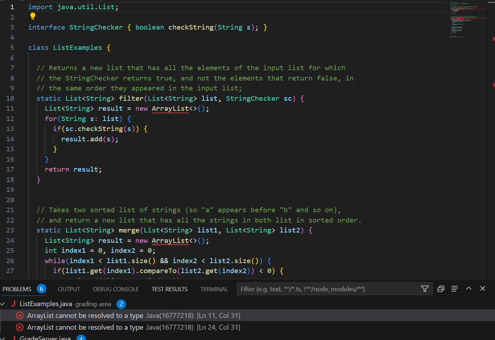
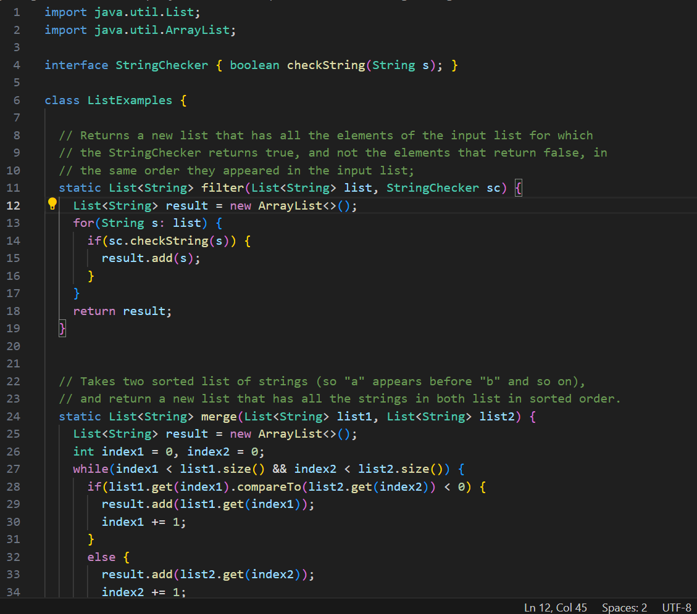
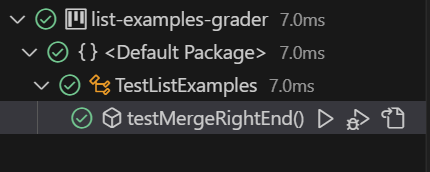

**I am having trouble running this test. I am getting errors that should not be occurring. What could be the reason**

> Make sure you review all you code for syntax or simple errors. Remember that the ArrayList class is not part of the default Java 

**After reviewing my code, I noticed that I did not import the Java ArrayList which is what prevented the merge() method from working**

**After making the changes, the ArrayList works and the tests involving merge() now pass.**

**The ListExamples.java file includes various String methods. The bug was triggered by doing `javac ListExamples.java` and `ListExamples.java`to compile and run the file. Thats when I noticed that problems were preventing the file from running properly.**

## Reflection
> In the second half of the class, one thing that I found to be interesting is the use of Vim and other tools. Topics such as navigating Vim are interesting to me because it is a skill and concept that has not been touched upon in the other courses that I have taken. I remember finding it very intersting to think about how someone who has become ver skilled in Vim could be capable of zipping around and quickly navigating a file and making changes at a very fast rate. Above all, this course has provided me with a more personal and hands on experience with computer science that other CSE courses are not able to provide. 

